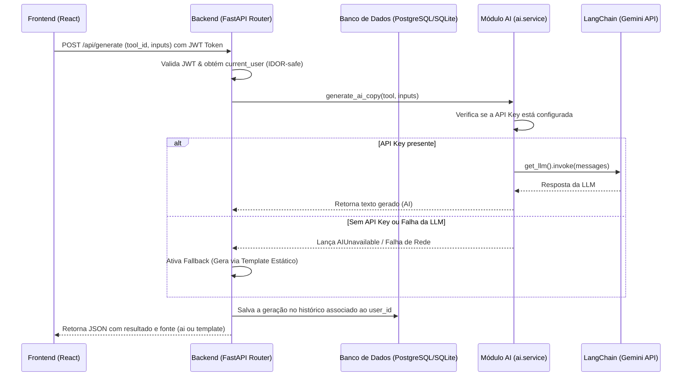

# Guia de Integração e Padrão de IA (LangChain + Gemini)

Este documento define os padrões de arquitetura e implementação para desenvolvimento de recursos de Inteligência Artificial usando **FastAPI**, **LangChain** e os modelos **Gemini** (Google Gen AI) no ecossistema do Nika IDE. 

O objetivo é permitir que qualquer desenvolvedor ou agente IA possa replicar ou estender recursos de automação de escrita, chat e análise de maneira padronizada, segura e resiliente.

---

## 1. Arquitetura Geral e Fluxo de Dados

A arquitetura de IA segue o princípio de **separação estrita de dados** e **resiliência (degradação suave)**:
- **Frontend** nunca armazena chaves de API nem faz chamadas diretas a provedores de LLM.
- **Backend** atua como um proxy seguro, autentica o usuário, carrega dados do banco de dados, monta o prompt e invoca a LLM.
- Se o serviço de LLM falhar ou a chave de API não estiver configurada, o backend **deve** conter uma lógica de fallback (ex: devolver um template estático ou uma resposta amigável) para que a aplicação não quebre para o usuário.
- Cada requisição de IA deve ser vinculada e filtrada pelo ID do usuário autenticado no banco de dados para evitar vulnerabilidades de **IDOR** (Insecure Direct Object Reference).



---

## 2. Configuração do Ambiente (.env)

O backend consome as chaves do arquivo `.env` para carregar o modelo de maneira dinâmica:
```bash
# Chave da API do Google Gemini (qualquer uma das duas chaves é aceita)
GEMINI_API_KEY=sua_chave_aqui
GOOGLE_API_KEY=sua_chave_aqui

# Nome do modelo a ser usado (Default: gemini-3.1-flash-lite)
GEMINI_MODEL=gemini-3.1-flash-lite
```

---

## 3. Estrutura de Pastas do Módulo de IA

A inteligência artificial fica concentrada na pasta `/backend/ai/`:
```text
backend/ai/
├── __init__.py
├── llm.py         # Inicialização do modelo (LangChain ChatGoogleGenerativeAI)
├── prompts.py     # Definições de Prompts do Sistema e construtores de mensagens
├── service.py     # Lógica de negócio de IA (chamada à LLM, fallbacks, limpezas)
└── specs.py       # Requisitos específicos de volume e formato por ferramenta
```

---

## 4. Implementações do Módulo de IA

### A. llm.py (Inicialização Lazy do Modelo)
Este arquivo inicializa o modelo de chat do Gemini de maneira preguiçosa (Lazy) e otimizada com `@lru_cache`, evitando inicializações redundantes.

```python
import os
from functools import lru_cache

DEFAULT_MODEL = "gemini-3.1-flash-lite"

def get_model_name():
    return os.getenv("GEMINI_MODEL", DEFAULT_MODEL)

def ai_enabled():
    """Retorna True se alguma chave da API do Google Gemini estiver configurada."""
    return bool(os.getenv("GOOGLE_API_KEY") or os.getenv("GEMINI_API_KEY"))

@lru_cache(maxsize=1)
def get_llm():
    """Instancia o modelo ChatGoogleGenerativeAI sob demanda."""
    from langchain_google_genai import ChatGoogleGenerativeAI

    return ChatGoogleGenerativeAI(
        model=get_model_name(),
        temperature=0.8,
        max_retries=2,
        timeout=120,
    )
```

### B. prompts.py (Construção das Mensagens)
O LangChain aceita uma estrutura de tuplas `(role, content)` muito simples e expressiva para montar o histórico e os prompts do sistema e usuário.

```python
SYSTEM_PROMPT = (
    "Você é um copywriter especialista em marketing de resposta direta. "
    "Escreve sempre em português do Brasil, com copy persuasiva e específica. "
    "Responda apenas com a copy final, em texto puro, sem comentários."
)

CONSULTANT_SYSTEM_PROMPT = (
    "Você é um consultor sênior de Marketing Digital. Seu papel é guiar "
    "um iniciante como um mentor próximo. "
    "Use formatação leve em markdown (títulos curtos, listas, negrito)."
)

def build_chat_messages(history, message):
    """Monta a lista de mensagens para o Chat, incluindo histórico."""
    messages = [("system", CONSULTANT_SYSTEM_PROMPT)]
    for item in history or []:
        role = item.get("role") if isinstance(item, dict) else getattr(item, "role", None)
        content = item.get("content") if isinstance(item, dict) else getattr(item, "content", None)
        if not content:
            continue
        messages.append(("ai" if role == "assistant" else "human", content))
    messages.append(("human", message))
    return messages

def build_messages(tool, inputs):
    """Monta o prompt para geração de copy baseada em ferramentas do catálogo."""
    human = (
        f"Tarefa: gere \"{tool['title']}\".\n"
        f"Dados fornecidos: {inputs}\n"
    )
    return [
        ("system", SYSTEM_PROMPT),
        ("human", human),
    ]
```

### C. service.py (Execução de IA)
Orquestra a chamada à LLM obtida de `llm.py`, lidando com verificação de chaves e formatação final do texto.

```python
from ai.llm import ai_enabled, get_llm
from ai.prompts import build_messages, build_chat_messages

class AIUnavailable(Exception):
    """Exceção lançada quando as chaves de API não estão configuradas."""

def _extract_text(content):
    """Normaliza o conteúdo retornado pela resposta do LangChain em uma string limpa."""
    if isinstance(content, str):
        return content
    if isinstance(content, list):
        parts = [part if isinstance(part, str) else part.get("text", "") for part in content]
        return "".join(parts)
    return str(content)

def generate_ai_copy(tool, inputs):
    if not ai_enabled():
        raise AIUnavailable("API Key não configurada no ambiente.")

    messages = build_messages(tool, inputs)
    response = get_llm().invoke(messages)
    text = _extract_text(getattr(response, "content", response)).strip()

    if not text:
        raise ValueError("Resposta vazia do modelo.")
    return text

def chat_reply(history, message):
    if not ai_enabled():
        raise AIUnavailable("API Key não configurada no ambiente.")

    messages = build_chat_messages(history, message)
    response = get_llm().invoke(messages)
    text = _extract_text(getattr(response, "content", response)).strip()

    if not text:
        raise ValueError("Resposta vazia do modelo.")
    return text
```

---

## 5. Exemplo de Integração em Endpoints (FastAPI)

Os endpoints do FastAPI devem integrar a lógica de IA de maneira a prever falhas de rede/API e assegurar a proteção contra **IDOR** (sempre filtrando as conversas e gerações pelo ID do usuário autenticado).

### A. Endpoint de Geração com Fallback (`/api/generate`)
```python
from fastapi import APIRouter, Depends, HTTPException, status
from sqlalchemy.orm import Session
from database.core import get_db
from database.models import User, Generation
from api.auth import get_current_user
from ai.service import generate_ai_copy, AIUnavailable

router = APIRouter(prefix="/api/generate", tags=["generate"])

def _build_copy_with_fallback(tool, inputs):
    try:
        # Tenta gerar com IA
        return generate_ai_copy(tool, inputs), "ai"
    except (AIUnavailable, Exception):
        # Fallback para gerador de template local
        from generators import generate_copy
        return generate_copy(tool["id"], inputs), "template"

@router.post("")
def create_generation(
    data: GenerateRequest,
    db: Session = Depends(get_db),
    user: User = Depends(get_current_user), # Autenticado
):
    tool = get_tool_by_id(data.tool_id)
    if not tool:
        raise HTTPException(status_code=404, detail="Ferramenta não encontrada.")

    # Executa a geração com fallback transparente
    result, source = _build_copy_with_fallback(tool, data.inputs)

    # Persiste no banco de dados vinculando ao user.id (Prevenção de IDOR)
    generation = Generation(
        user_id=user.id,
        tool_id=data.tool_id,
        result=result,
        inputs=data.inputs,
    )
    db.add(generation)
    db.commit()
    db.refresh(generation)

    return {
        "id": str(generation.id),
        "result": generation.result,
        "source": source,
    }
```

### B. Endpoint de Chat com Memória Histórica (`/api/chat`)
No chat, a memória é alimentada recuperando o histórico de mensagens associado à conversa diretamente do banco de dados, garantindo que o usuário só acesse suas próprias conversas.

```python
from fastapi import APIRouter, Depends, HTTPException, status
from sqlalchemy.orm import Session
from database.models import User, Conversation, Message
from api.auth import get_current_user
from ai.service import chat_reply, AIUnavailable

router = APIRouter(prefix="/api/chat", tags=["chat"])

_FALLBACK_REPLY = "Desculpe, meu módulo de IA está offline. Me conta: qual o seu objetivo para adiantarmos?"

def _get_user_conversation(db: Session, user_id: int, conversation_id: str):
    # Garante segurança contra IDOR filtrando estritamente pelo user_id do token
    conv = db.query(Conversation).filter(
        Conversation.id == conversation_id,
        Conversation.user_id == user_id
    ).first()
    if not conv:
        raise HTTPException(status_code=404, detail="Conversa não encontrada.")
    return conv

@router.post("/conversations/{conversation_id}/messages")
def send_message(
    conversation_id: str,
    data: SendMessageRequest,
    db: Session = Depends(get_db),
    user: User = Depends(get_current_user),
):
    # Recupera conversa validando propriedade
    conversation = _get_user_conversation(db, user.id, conversation_id)
    
    # Reconstrói a memória a partir das mensagens salvas no banco
    history = [{"role": m.role, "content": m.content} for m in conversation.messages]

    # Salva a nova mensagem do usuário
    user_msg = Message(conversation_id=conversation.id, role="user", content=data.content)
    db.add(user_msg)

    # Obtém resposta da LLM
    try:
        reply = chat_reply(history, data.content)
    except (AIUnavailable, Exception):
        reply = _FALLBACK_REPLY

    # Salva a resposta da IA
    assistant_msg = Message(conversation_id=conversation.id, role="assistant", content=reply)
    db.add(assistant_msg)
    
    db.commit()
    
    return {
        "user_message": {"role": "user", "content": user_msg.content},
        "assistant_message": {"role": "assistant", "content": assistant_msg.content}
    }
```

---

## 6. Lista de Verificação (Checklist) para Novos Recursos de IA

1. [ ] **Isolamento de Chaves**: Nenhuma chave de API no frontend.
2. [ ] **Verificação de Chaves**: `ai_enabled()` retorna falso de forma graciosa sem disparar erros críticos no boot do app.
3. [ ] **Fallback Estático ou Amigável**: Existe tratamento de exceção (`try...except`) para todas as chamadas da LLM.
4. [ ] **Estrutura de Mensagens**: Prompts estruturados no `prompts.py` via tuplas `(role, content)`.
5. [ ] **Proteção IDOR**: Todo salvamento de histórico e consulta de chat de IA filtra explicitamente por `user_id == current_user.id`.
6. [ ] **Validação de Entrada**: Formatos e tamanhos de parâmetros de prompt validados via esquemas Pydantic no Router do FastAPI.
